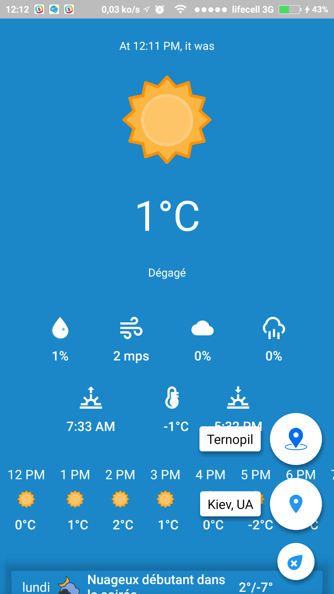
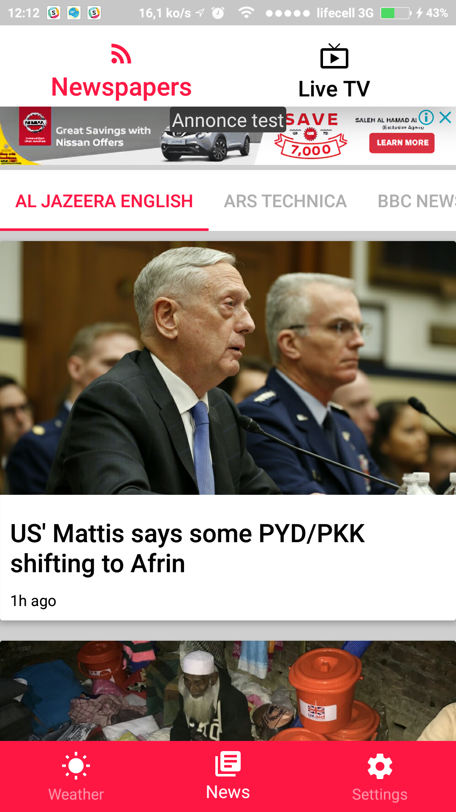
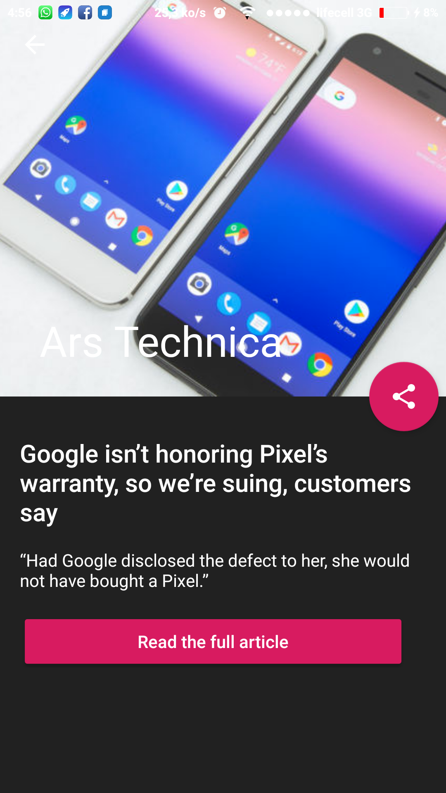
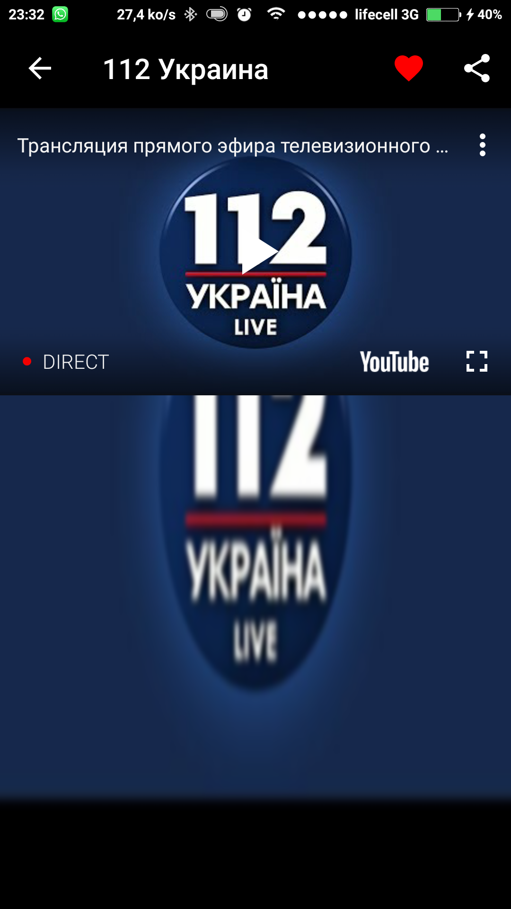

# DBWeather

## Project Overview
Android multimedia application with weather forecasts, a news feed in every language , and Live TV using youtube live.

## Features

### Weather

Provides localized and detailed Weather reports based on the user's location:

### News Feed

Provides a feed to current world events and other important news:

### Live TV:

Browse and View Live News Channels via Youtube Live:

## Project Structure:

DBWeather utilizes a modular style of project structure, which divides the project into Modules based on Features and Layers of the Application's Architecture. Such modules include:

### app

Front end View implementations and Android Framework Classes. Presenters and Contracts for the frond end are defined in separate modules.

### dbweathercommon:

Global high level Interfaces and Utilities.

### dbweatherdata:

Backend implementations to local and remote Datasources. Keeping them in a separate module increases modularity and separation of concerns. 

### dbweatherdomain:

Contains Entities based on the Problem Domain, and high level contracts which define the repositories implemented in the data module.

### dbweathernews:

Contains logic and contracts which define the front end of the News Feed and Live TV features. 
 
### dbweatherweather:

Contains logic and contracts which define the front end of the Weather feature. 

## Project Architecture

DBWeather utilizes a highly modular Clean Architecture which is based on ideas from multiple styles of Architecture, including MVP, MVVM, and MVI. The goal of these principles is to encourage:
- Decoupling/Separation of Concerns by dividing Presentation, Domain, and Data logic/contracts from their respective interfaces. This allows different modules of the project to be changed, without necessitating changes in other modules. 
- High Legibility due to proper separation of concerns, which leads to descriptive and unambiguous names (Weather, News, etc.).

## Tools and APIs:

DBWeather uses a wide array of industry standard APIs in places where it makes sense to use them. Such APIs include (but not limited to):
- Dagger 2 for Dependency Injection
- Android's AAC (Room) for Data Persistence
- Retrofit 2 + OKHttp for Network IO
- RxJava 2 for concurrency and event logic

## Contact Info

https://twitter.com/darel_bitsy

https://www.facebook.com/darel.bitsy

https://github.com/bitsydarel
